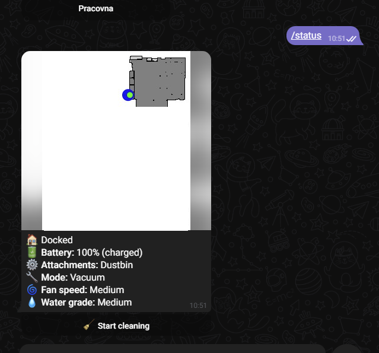

# Valetudo telegram bot

Basic bot that allows you to control and monitor your Valetudo enabled cleaning robot.

## Features

 - Send you notifications when bot status changes (cleaning, docked, etc)
 - Start/Stop/Pause/Home robot
 - Report robot status with map
 - Send robot to clean specific room(s)

## Initial setup

### 1. Create your own bot
You'll need to have your own bot. Follow this official guide to obtain your bot token: https://core.telegram.org/bots/tutorial

### 2. Start the application

#### Without docker

Download latest release for your target platform, then copy `.env.example` from this repo into `.env` and fill in the values.

#### Using docker

The image is [skacekamen/valetudo-telegram-bot](https://hub.docker.com/repository/docker/skacekamen/valetudo-telegram-bot/general), it should supports ARM64, ARM64 and ARM. The configuration is provided by environment variables.

```
services:
  valetudo-telegram-bot:
    image: skacekamen/valetudo-telegram-bot:latest
    environment:
      - TELEGRAM_BOT_TOKEN=...
      - VALETUDO_URL=http://YOUR_ROBOT_IP_ADDRESS
      - TELEGRAM_CHAT_IDS=YOUR_TELEGRAM_ID_OR_EMPTY
    restart: unless-stopped
```

### 3. Add your chat id

If you don't already know your `TELEGRAM_CHAT_ID`, you can just start the bot without it. Then just send it random message and it should respond with your ID. Input this id and restart your bot and you should be able to start using your bot.


## Showcase


